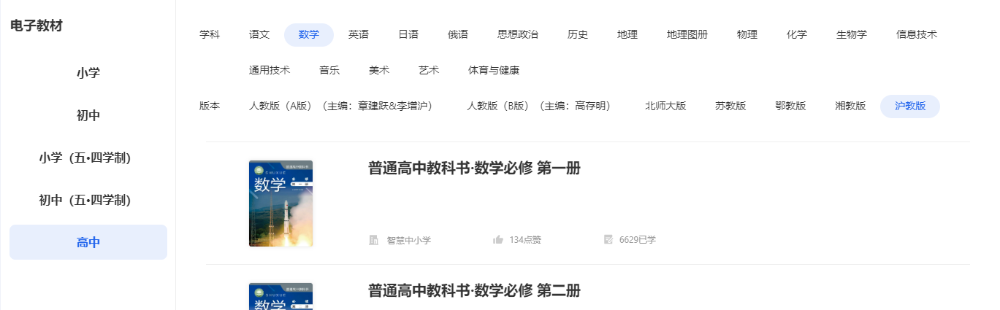

# Textbooks Downloader

A textbooks downloader for the China's textbooks.

**Download Source**: https://www.zxx.edu.cn/elecEdu

## Getting Started

```sh
yarn install # install dependencies
yarn playwright install # install playwright browsers
yarn start # start downloading
```

## Configuration

```js
const CONFIG = {
  PERIOD: "高中", // 学段, according to the following screenshot's left side
  SUBJECT: "数学", // 学科, subject, according to the following screenshot's top bar
  VERSION: "沪教版", // 版本, version, according to the following screenshot's top bar
  OUT_DIR: "books", // output directory
};
```



(Visit https://www.zxx.edu.cn/elecEdu to check your own options.)

## About

This project is inspired by [CLCK0622/OnlineTextbooks](https://github.com/CLCK0622/OnlineTextbooks). And thanks to @aeilot for recommending me the official textbooks source.
